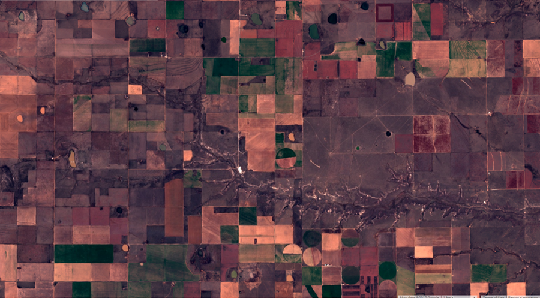
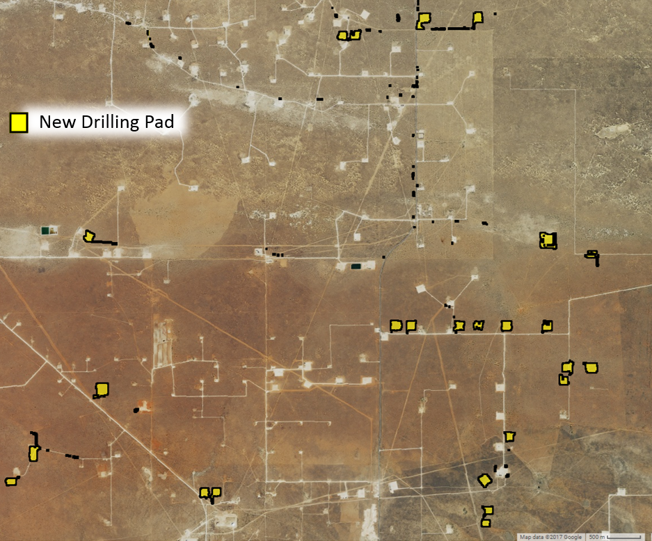
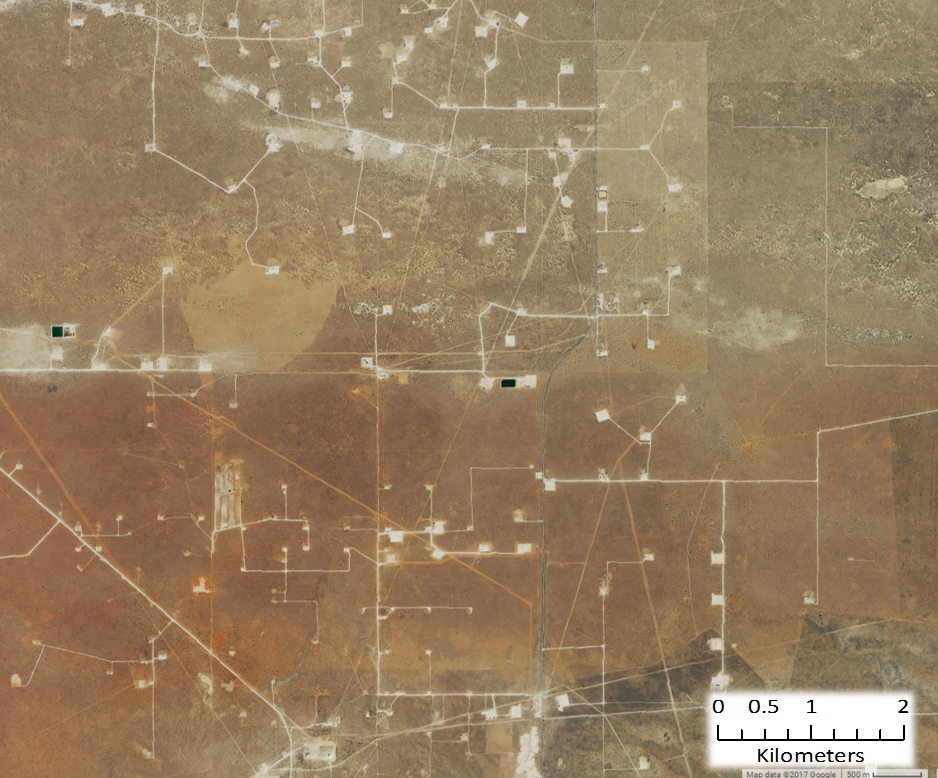

```{r setup, include=FALSE}
knitr::opts_chunk$set(echo = TRUE)
data(rus)
#n <- nrow(rus)
library(dplyr)
library(ggplot2)
library(leaflet)
library(lme4)
library(mclogit)
library(party)
library(plotly)
library(pROC)
library(sensitivity)
library(shiny)
library(stringr)
library(tidyr)
```

## Background

### Lesser Prairie-Chicken

The Lesser prairie-chicken (Tympanus pallidicinctus) is a species of grouse native to regions of Colorado, Kansas, Oklahoma, Texas, and New Mexico.  Throughout their range, Lesser prairie-chicken (LPC) require a mixture of sagebrush, native grass prairie, and shrublands.  Much of this habitat has been lost as the result of conversion to agricultural land, and the distribution of LPC is now only 10% of its historical range.  LPC habitat can also be degraded by energy development, due to the species’ avoidance of tall structures – a behavior adapted to avoid aerial predators (1).

In an effort to protect LPC and prevent its listing as an endangered species, the Western Association of Fish and Wildlife Agencies developed a range wide conservation plan (RWP) in 2013.  The RWP provides voluntary impact minimization, and mitigation strategies for private landowners and companies conducting activities that would degrade LPC habitat.  Lesser prairie-chicken was nevertheless listed as a threatened species under the Endangered Species Act (ESA) on March 27, 2014 (2), at which point enrollment in the RWP was offered to corporate developers as a means of fulfilling their obligation to offset LPC habitat destruction under the ESA.  A court ruling on September 1st, 2015 overturned the listing decision, and the LPC was removed from the endangered species list in April 2016.  The RWP remains, but mitigation and impact minimization programs have reverted to purely voluntary efforts.  The purpose of this analysis was to quantify the extent of energy development and habitat loss occurring since delisting, using a combination of publicly available data and remote sensing.

### Remote Sensing

In this analysis, the term ‘Remote sensing’ describes the use of light reflectance from earth’s surface measured by sensors on satellites, to quantify patterns of land cover and land use.  A recent proliferation of available satellite data has increased the use of remote sensing in conservation work.  Many satellite systems collect new images across the globe on a bi-weekly basis, advancing the ability to quickly detect and quantify habitat loss.  Satellite sensors also measure reflectance values beyond the visible light spectrum, including infrared and ultraviolet light, providing a greater ability to distinguish among land cover types, and features on the earth’s surface, than photographs.  
In this analysis, we used Google Earth Engine - a platform providing access to terabytes of real-time satellite data, and the cloud computing capabilities to analyze them – to create an automated process to detect wind turbines, oil and gas wells, and habitat loss throughout the LPC’s range.  The basic overview of the process shown in Figure 1 is:

1.	Acquire ‘before’ and ‘after’ satellite data
2.	Calculate changes in earth surface reflectance values
3.	Select pixels exceeding reflectance change thresholds
4.	Distinguish man-made vs. natural changes

<div class = "juxtapose" data-startingposition = "25%">
  
  
</div>


### Data

Oklahoma provides approval dates.  We selected all records approved after Sept. 01, 2015.
Kansas provides year start.  To be conservative, we selected all records starting in 2016 and 2017.
Colorado provides 'spud date.'  We selected all records after Sept. 01, 2015.

New Mexico provides approval, effective, and spud dates.  

Texas provides approved date, and completion date.

The LPC RWP specifies buffer distances around specific forms of habitat disturbance.  We buffered newly constructed turbines and oil and well pads by 667m and 200m, respectively.  Private roads were buffered by 10m.

http://www.kansasenergy.org/wind_projects.htm

If suitable sentinel data was not available before the well date, we compared aerial imagery from before the well date to the suitable sentinel data after the well date.  If no change was detected...

## Results

### Wind Energy Development

Using our automated change detection procedure, we identified 5 wind farms with a total of 713 turbines constructed after September 1st, 2015 within LPC range.  The LPC range wide plan uses a buffer of 667m around turbines to determine the area for which mitigation is needed.  Under the RWP, construction of these 713 turbines would create 129,739 acres of potential mitigation area.  From a biological perspective, LPC avoid tall structures up to 1 mile away, and areas within 1 mile of wind turbines are considered biologically disturbed, or degraded habitat (3).  When a 1 mile buffer is considered, these 713 turbines create 257,577 acres of habitat disturbance for LPC.

### Oil and Gas

Oil and gas drilling permits and production records are maintained by state oil and gas commissions, including project start dates and well locations.  In theory, these records can be used to measure the number and location of disturbances within LPC habitat due to oil and gas drilling.  We obtained all records (378) of new wells reported after September 1st 2015 located within LPC range, and verified the construction of a new well using before and after satellite imagery where available.  Satellite images revealed new wells within 500m of reported locations for only 178 records (57%) of 310 that we could inspect (Table 1).

```{r p1, echo=FALSE, warning=FALSE, error=FALSE}
fluidPage(
  fluidRow(
    column(12,
      p(class = "caption",
        tags$b("Table 1."), " Counts of new oil and ga wells reported by state oil and gas commissions constructed after Spetember 1", tags$sup("st"), "2015, and located within Lesser -rairie-chicken range.")
    )
  )
#  fluidRow(
#    div(
#    column(12,
#  DT::datatable(tab,
#                    fillContainer = TRUE,
#                    selection = list(mode = 'single', 
                                     #selected = which(Bay16$SITE == input$sites), 
#                                     target = 'row'),
#                    colnames = c("Site", "Turbines", "Survey Effort (hr*km2)",
#                                 "Eagle Obs (min)"),
#                  options = list(rownames = FALSE,
#                                 pageLength = nrow(tab),
#                                 dom = 'tip'
#                                 )
#                )%>%
#  DT::formatRound("EFFORT", 2)
#    ))
#  )
)
```

These discrepancies could be caused by errors in recording dates and/or coordinates, unreported changes in project timelines, or in many cases, vague constructions dates.  For instance, New Mexico reports a ‘Spud date,’ the date on which ground was broken when drilling a new well.  Kansas provides a ‘Year Start’ with well records, which leaves the actual date at which a new well is constructed ambiguous.  We confirmed the construction of new wells at 92% of reported locations that were checked in New Mexico, but only 28% of those in Kansas.

Applying our change detection algorithm across LPC range identified 179 new well pads that appeared in LPC habitat since delisting, which did not correspond to any coordinates provided by the states (> 500m from any reported location).  The RWP uses a buffer of 200 meters around oil and gas wells to determine the area for which mitigation is needed.  The 178 reported wells we identified create 3,150 acres of potential mitigation area, after excluding areas around wells built in already degraded habitat.  The 179 additional wells we identified - that were not associated with oil and gas commission records - created an additional 5,800 acres of potential mitigation area. 

<div class = "juxtapose" data-startingposition = "25%">
  
  
</div>
<script src="https://cdn.knightlab.com/libs/juxtapose/latest/js/juxtapose.min.js"></script>
<link rel="stylesheet" href="https://cdn.knightlab.com/libs/juxtapose/latest/css/juxtapose.css">


```{r p2, echo=FALSE, warning=FALSE, error=FALSE}
fluidPage(
  fluidRow(),
  fluidRow(
    column(12,
           p(class = 'caption',
             tags$b("Figure 2."), "Exapmle of oil well pads constructed after September 1", tags$sup("st"), ", 2015 identified by automated land cover change detection.")
    )
  )
)
```

In total, we detected 1,070 disturbances due to energy development within LPC range since the species was delisted, creating 138,689 acres of potential mitigation area under the RWP (Figure 3).  It is important to note that the thresholds we used to detect well pads and wind turbines were selected to minimize the chance of false positives. Due to this conservative approach, some true disturbances were eliminated from consideration by our algorithms, and the numbers reported represent a minimum amount of disturbance in LPC habitat occurring since delisting.

```{r p3, echo=FALSE, warning=FALSE, error=FALSE}
fluidPage(
  fluidRow(),
  fluidRow(
    column(12,
      p(class = 'caption',
        tags$b("Figure 3."), " Locations of wind farms, oil and gas wells constructed within Lesser prairie-chicken habitat constructed after September 1", tags$sup("st"), ", 2015 identified by automated land cover change detection.  The range used is tha tocnsidered in the range-wide plan for evaluating the need for mitigation.  This is a 10 mile buffered area around existing LPC habitat")
    )
  )
)
```

### Habitat Loss

In addition to tracking energy development, we wanted to estimate the overall loss of LPC habitat across the species’ range since delisting.  The majority of habitat loss is from conversion of native grass prairie and shrubland to agriculture.  Using annual cropland data from the U.S. Department of Agriculture, we estimate between 85,000 and 184,000 acres of LPC habitat was converted to agriculture from 2015 to 2016 (Figure 4).  The range of estimated acreage is based on different level of confidence in the classification USDA assigns to each pixel.  The lower value of 85,000 acres was calculated only from areas with > 90% confidence that LPC habitat in 2015 was converted to agriculture in 2016.   Lowering this confidence threshold to 75% produces an estimated 184,000 acres converted.  We cross-validated these estimates against a calculation using the maximum, and variation in greenness over the course of the growing season.  Using this approach, an estimate with 75% confidence indicated 184,000 acres were converted.

```{r p4, echo=FALSE, warning=FALSE, error=FALSE}
fluidPage(
  fluidRow(),
  fluidRow(
    column(12,
           p(class = 'caption',
             tags$b("Figure 4."), " Conversion of Lesser priairie-chicken habitat to agriculture between 2015 and 2016.  A raw score of conversion probability (a) was used to identify areas of potential agricultural conversion across LPC range.  Total area converted was estimated by selecting areas with at least 90% confidence (b), and 75% confidence (c)."
           )
    )
  )
)
```

## Methods

### Change Detection
For automated change detection, we used pre-processed Sentinel-2 satellite imagery, available on Google Earth Engine, to conduct change detection analyses.  Sentinel-2 is a remote sensing satellite system deployed and maintained by the European Union, providing global coverage of 10m resolution imagery every 12 days.  Sentinel-2 images contain 12 bands recording reflectance values in the visible, near infrared, short-wave infrared, and near ultraviolet spectra.  To avoid the potential for seasonal phenology to confound true land cover change, we first selected Sentinel-2 scenes across LPC range acquired outside of the growing season (November to March).  Scenes collected in 2015/16 were used as ‘before’ imagery and those in 2016/17 as ‘after’.  We removed cloudy pixels from each image using a filter on the provided quality assurance band, which identifies clouds, shadow, snow, and water, and created a single image composite by selecting the median value of each pixel stack.

Our automated change detection algorithm extended methodology used by the U.S Geological Survey to produce the National Land Cover Dataset (NLCD) land cover change data .  We calculated four spectral change metrics between before and after imagery.  The Change Vector (CV) measures the total change in reflectance values between two images across the visible and infrared spectrum, and Relative CV Maximum (RCVMAX) measure the total of changes in each band scaled to their global maxima.  Differences in Normalized Difference Vegetation Index (dNDVI) uses ratios between near infrared and red reflectance to indicate changes in the concentration of vegetation.  We additionally calculated differences in a Ratio Normalized Difference Soil Index (dRNDSI) , which uses ratios between short-wave infrared and green reflectance to indicate changes in the concentration of bare ground.  Pixel values for each change metric were converted to z-scores representing the likelihood of land cover change relative to global means for normalized indices (RNDSI & NDVI), and global minimums for scaled indices (CV and RCVMAX).  The output was a four-band image consisting of the standardized z-scores for each change metric at each pixel, covering the entire LPC range.  All calculations and transformations were performed in Google Earth Engine.

### Change Validation

Due to the distinct spatial pattern of wind farms (Figure 1d), we identified new farms by examining the change metric output visualized to highlight losses in vegetation and increases in bare ground.  We then visually inspected the most recent available Sentinel-2 imagery at new wind farm locations to identify and mark individual turbines.  Oil and gas well pads are small and less distinct.  Therefore, we defined change metric thresholds that identified replacement of natural land cover with well pads.  We selected a set of 100 validation plots from the change metric image in areas with high change likelihoods that did (true positive) and did not (false positive) correspond to the addition of well pads.  We extracted the change metric z-scores within these validation plots, and performed linear discriminant analysis (LDA) to estimate the coefficients for a linear transformation maximizing differentiation between true and false positive validation data.  We used a receiver operating characteristic (ROC) curve and selected the LDA score maximizing the second derivative (i.e., rate of change in curve slope) of the relationship between false positive and detection rate (Figure 4a), as a threshold for automatically identifying new well pads. We then converted areas meeting or exceeding this threshold to change polygons.  LDA and ROC analyses were conducted in R using the pscl and pROC packages.

```{r p5, echo=FALSE, warning=FALSE, error=FALSE}
fluidPage(
  fluidRow(
    subplot(change_plot, shape_plot, nrows = 1, shareX = TRUE, shareY = TRUE)
  ),
  fluidRow(
    column(12,
           p(class = 'caption',
             tags$b("Figure 4."), " Receiver operating characterstic (ROC) curves plotting linear discriminant analysis scores for (a) change metrics and (b) shape metrics used to identify new drilling pads.  The values at which the rate of increase in detection rate relative to fals epositive rate decreases most rapidly (indicated by arrows) were selected as threshold values."
           )
    )
  )
)
```


We then needed to discriminate between natural land cover changes that matched well pad spectral characteristics, and true human disturbances.  We calculated a suite of shape metrics for each land cover change polygon, including convexivity, circularity, elongation, and compactness, that had the potential to delineate more regular, compact shapes formed by human activity from irregular shapes associated with natural land cover change .  We then manually classified a validation set of 400 polygons, and as with reflectance thresholds, used LDA and ROC curves to identify values discriminating between true and false positives (Figure 4b).  We then examined the most recent Sentinel-2 imagery at each polygon meeting spectral and shape criteria to confirm the presence of a well pad constructed after September 1st, 2015, and deleting all other polygons.  For each choice of threshold, the true positive detection rate was less than one, and therefore this approach eliminated a small set of true human disturbances.  Thus, the results reported represent a lower bound for the minimum number of new pads.

### Mitigation Area

We further restricted the set of oil and well pads to those occurring within areas identified as shrub/scrub, or grassland by the NLCD 2011 classifications.  This eliminated disturbances occurring within already degraded habitat (i.e. agriculture) from further consideration.  The RWP requires a buffer distance of 200 m around oil and gas wells, and 667 m around wind turbines to determine disturbed acreage that must be offset by habitat mitigation.  To estimate lost potential mitigation opportunities, we buffered the new well pad polygons and turbine locations by their respective distances.  We then eliminated buffered areas within which disturbances were already present (Figure 5a), as these could have potentially already been mitigated, or constitute degraded habitat, and thus be subject to discounted mitigation acreage .  Estimated potential mitigation acreage was calculated as the total acreage of all remaining buffered areas.

### Agriculture Conversion
To detect conversion of LPC habitat to agriculture, we used Lansat-8 orthorectified top-of-atmosphere reflectance imagery, available on Google Earth Engine.  Landsat-8 is a remote sensing satellite system deployed and maintained by the U.S. Geological Survey, providing global coverage of 30m resolution imagery every 16 days.  To calculate changes in greenness over the course of the growing season, we selected Landsat-8 scenes across LPC range acquired between April and October.  We defined scenes collected in the growing season of 2015 as ‘before’ conditions, and those collected in 2016 as ‘after’ conditions.  We removed cloudy pixels from each image using using the Fmask  algorithm, which calculates the probability that a pixel is a cloud, shadow, or snow.  We excluded pixels with a probability > 0.2.

We used two approaches to estimate the area of LPC habitat converted to agricultural land since the species was delisted.  For both approaches, we considered the growing season (May 01 – September 01) of 2015 to represent ‘before’ conditions, and the growing season of 2016 as ‘after’ conditions.  Our first approach followed similar methodology to a previous study of habitat loss , and used the U.S Department of Agriculture’s annual Cropland Data Layer (CDL).  This product classifies agricultural land by crop type across the United States, using a combination of satellite reflectance, elevation, and ground-truthing data .  The product is a 30m resolution raster whose pixels have a ‘cropland’ value designating crop type, and an assignment confidence score [0, 1].  To estimate LPC habitat conversion to agriculture, we selected pixels classified as either scrubland or grassland in the 2015 CDL, and as any crop type in the 2016 CDL.  We performed this calculation using two different confidence thresholds, excluding pixels with < 75% assignment confidence, and excluding pixels with < 90% confidence.  We applied two successive majority filters to each result to eliminate single, isolated pixels creating more contiguous areas of change or non-change.  Areas representing change were then converted to polygons.  Finally, due to the concave and patchy nature of the per-pixel output, we created minimum-area bounding boxes around each polygon, which more accurately represent the footprint of an agricultural parcel.  The sum area of all resulting polygons was used as the first estimate of habitat loss.

Our second approach used measures of intra-annual variation in greenness, as indicated by NDVI.  We calculated NDVI across LPC range using Landsat-8 30m resolution images obtained between April 30th and September 1st in 2015 (before) and 2016 (after).  For each year, we calculated the dispersion (sample variance normalized by sample mean) and maximum NDVI value across images at each pixel.  Our expectation was that agricultural land cover would have both greater variance, and maximum NDVI values over the course of a growing season than natural landcover. Thus, conversion from LPC habitat to agriculture would be indicated by an increase in both values from 2015 to 2016.  To estimate the likelihood of conversion, we calculated the difference between NDVI dispersion and maxima between the two years.  

Small sample size can bias estimates of dispersion.  Therefore, we adjusted observed NDVI metrics by a measure of uncertainty based on the number of images available at a pixel location.  The probability of true population variance (σ2) given a sample variance (s2) and sample size (n) can be estimated by an Inverse Gamma distribution: P(σ2 | s2, n) ~ IG(n/2, (n-1)*s2/2).  We used the ratio of the probability density for the observed sample variance from a distribution parameterized by the actual sample size, to one parameterized by the maximum possible sample size, as an adjustment factor for observed dispersion.  The adjustment factor (AF) for observed dispersion at a given pixel i was:

We adjusted all NDVI dispersion values by the adjustment factors per pixel, using the maximum number of images available within the growing season (16) as n_max.
To identify thresholds representing true conversion of LPC habitat to agriculture, we generated distributions for expected differences in NDVI dispersion and max between habitat and agricultural land cover types.  We took a random sample of NDVI dispersion, maximum, and image count values at 50,000 pixels where image count was at least 6.  We used the CDL to further restrict this sampling to pixels with an assignment confidence of at least 90%, and extracted the ‘cropland’ attribute.  This created a dataset of NDVI dispersion and max values for each crop and landcover type.  From this data, we generated probability distributions for the expected change in NDVI dispersion and maxima corresponding to conversion between all combinations of shrub/grassland, alfalfa, corn, wheat, sorghum, and fallow land cover types by iteratively calculating the difference between 5,000 random samples drawn from the observed distributions for each crop and habitat category (Figure 7).  We calculated the densities across values, and standardized to sum to 1.  From these distributions, we calculated the cumulative probability that an observed change in NDVI dispersion and max corresponded to land cover change from LPC habitat to agriculture.

```{r p6, echo=FALSE, warning=FALSE, error=FALSE}
fluidPage(
  fluidRow(
    subplot(change_plot, shape_plot, nrows = 1, shareX = TRUE, shareY = TRUE)
  ),
  fluidRow(
    column(12,
           p(class = 'caption',
             tags$b("Figure 6."), " Probability distributions for expected change sin NDVI dispersion and maxima if land is converted from Lesser prairie chicken habitat to different crop types.  Curves represent the frequency of expected values (a, b) and probability of observing a change value (c, d) for each form of conversion.  Curves were used to select threshold change values, indicated by grey arrows, identifying when conversion occurred between growing seasons of 2015 and 2016, with 75 and 90% confidence."
           )
    )
  )
)
```

We estimated the probability of conversion as the sum of the probabilities of the observed change value given conversion to each agricultural class – defined by the inverse of the cumulative distributions of expected differences for each crop type – multiplied by the probability of the observed change value given no change – defined as the cumulative distribution of expected differences for habitat unchanged habitat.  To detect conversion to fallow land we used the cumulative distribution of expected differences for change from habitat to fallow, and the inverse cumulative distribution for unchanged habitat.

