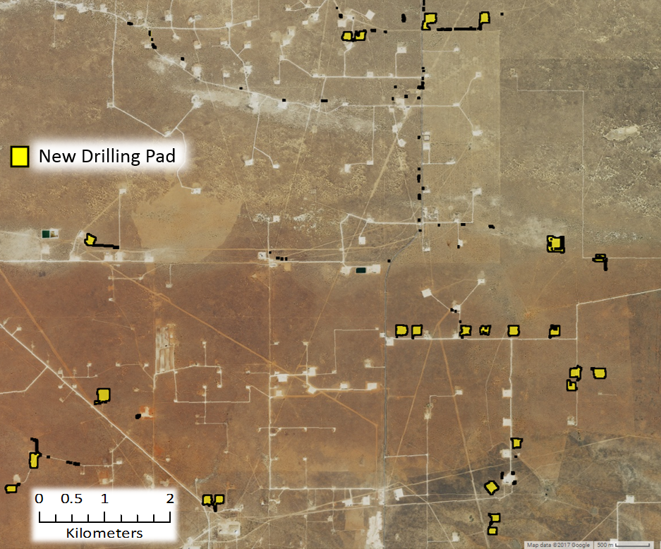

```{r setup, include=FALSE}
knitr::opts_chunk$set(echo = TRUE)
load("data/data.rda")
source("create_dist.R")

dt <- data.frame( c("CO", "NM", "TX", "KS", "OK", "TOTAL"), c(1,63,132,163,19,378), c(1,25,105,163,16,310), c(1,23,49,46,3,178))

dt$Rate <- round(dt[,4]/dt[,3],3)
colnames(dt) <- c("STATE", "Wells Reported", "Wells Inspected",
                                     "Wells Detected", "Detection Rate")

library(dplyr)
library(ggplot2)
library(party)
library(plotly)
library(pROC)
library(sensitivity)
library(shiny)
library(stringr)
library(tidyr)


```

# Project Summary
<div class = "abstract">
One of the biggest challenges to the effectiveness of the Endangered Species Act (ESA) is the absence of programs to monitor habitat conditions and compliance with ESA permits.  Without monitoring, conservationists do not know the total amount of habitat loss a species has experienced, whether mandatory conservation measures are being complied with, or whether those measures are effective.  In the past, proposed solutions to these problems have relied largely on increased funding from Congress for law enforcement staff and better databases to track ESA permits.  But given the low likelihood of this strategy succeeding in the current budget climate, conservationists must also pursue other strategies.  For many monitoring needs, remote sensing data offer a cost-effective solution.

Free or low-cost satellite data and aerial images have become widely available in recent years, and  conservationists already use these resources to document deforestation and unauthorized habitat destruction.  But many of these efforts require a person to visually scan large areas of habitat to identify the habitat loss of interest.  For example, a person may need to pan a map to look for disturbances that resemble oil well pads and then zoom in to verify the presence of pads.  This approach is too time consuming for multistate surveys and infeasible for a nationwide monitoring program.  

To help overcome this challenge, we developed a cost-effective technique to automatically detect three forms of habitat disturbance in endangered species habitat: oil and gas well pads, wind turbines, and agricultural conversion.  Our technique detects disturbances by applying algorithms we developed to satellite data generated by the National Aeronautics and Space Administration (NASA) and the European Space Agency, and served by Google.  For our pilot project, we applied the algorithms to satellite data of lesser prairie-chicken habitat.

We found extensive habitat loss and disturbance in the range of the lesser prairie-chicken between September 1, 2015, when a court removed ESA protections for the species, and April 1, 2017.   We detected eight wind farms with a total of 946 wind turbines.  Assuming turbines disturb habitat within a 667-meter radius, as the Western Association of Fish and Wildlife Agencies (WAFWA) does in its Range-wide Conservation Plan for the lesser prairie-chicken, we estimate that 164,895 acres of new habitat disturbance resulted from those turbines.  That estimate of disturbance increases to 334,551 acres if we use the more precautionary assumption of the U.S. Fish and Wildlife Service (FWS) that the species avoids a 1-mile radius around wind turbines.  We also found 311 oil and gas well pads constructed during the 19-month study period, which created a minimum of 8,950 acres of new habitat disturbance, assuming a 200-meter radius of disturbance around each pad, as both WAFWA and FWS have done.  Thus, a minimum of 173,845 acres of habitat loss or degradation occurred from energy development.  We provide the location of these wind turbines and oil and gas wells in a [web map](https://arcg.is/0K8H8).  According to WAFWA, its Range-wide Conservation Plan enrolled 523 energy development projects in 2015 and 2016, generating mitigation for 31,543 acres of impacts.  Thus, we presume that approximately 15-20 percent of the impacted areas we identified were mitigated under the plan.  

Finally, our algorithm for agricultural conversion identified between 85,000 acres (with 90 percent confidence) and 184,000 acres (75 percent confidence) of conversion from shrubland or grassland in 2016 alone.  Using the more conservative 90 percent confidence threshold, we estimate a minimum of 258,848 acres were disturbed from agricultural conversion and energy development in the range of the lesser prairie-chicken during the 19-month study period.  

Our study demonstrates a feasible approach to identifying certain types of habitat disturbance for an imperiled species using publicly-available satellite data.  This approach holds promise for similar analyses for other species and forms of habitat disturbance.  It is especially useful for rapidly estimating the cumulative effects of multiple land use activities across the range of a widely-dispersed species.  To maximize the potential for this approach to help with habitat and compliance monitoring, FWS and the National Marine Fisheries Service (NMFS) should post online all ESA plans and permits, including section 7 biological opinions and biological assessments, and section 10 habitat conservation plans.  Using these documents, interested stakeholders can compare the authorized footprint of a project with its actual footprint based on remote sensing data, and notify the appropriate wildlife agency of any potential violations.  By embracing open data and technology, the Services and conservationists can enhance the ESA’s effectiveness far more efficiently. 
</div>
# Background

### ESA Monitoring

The Endangered Species Act (ESA) is the primary tool for conserving many imperiled species in the United States.  Among its strengths are protections afforded to a variety of habitats for ESA-listed species.  But how well do those protections apply on the ground?  The U.S. Fish and Wildlife Service (FWS) has designated millions of acres of critical habitat, but little information is available on what percentage of that habitat remains intact[^1].   Likewise, the agency has finalized over a thousand ESA conservation agreements, many of which authorize habitat destruction in exchange for mitigation to offset some of those impacts.  Perennial funding shortages, however, have left FWS unable to monitor for compliance with many of those agreements[^2].   Left unresolved, the lack of monitoring could become the weakest link to conserving many species, undermining the expensive and difficult work of listing the species, designating critical habitat, and negotiating conservation agreements.  Given the central role that habitat conservation plays in protecting and recovering listed species, methods for automatically monitoring habitat loss could substantially improve the effectiveness of the ESA.

The lack of a comprehensive monitoring program is a serious problem.  One example comes from our 2013 analysis of the Texas Conservation Plan for the Dunes Sagebrush Lizard[^3].   Using satellite images, we revealed multiple instances of unreported and unauthorized oil well pads and roads in habitat that was supposedly protected under the plan.  None of the disturbances appeared in the monthly monitoring reports the permittee provided to FWS.  Two years later, while browsing on Google Earth and reviewing a random set of ESA habitat conservation plans (HCPs), we encountered another example of apparent noncompliance.  Satellite images revealed that under an HCP for the eastern indigo snake in Georgia, over half of a 25-acre parcel of forest had been cleared despite the requirement that the permittee manage the parcel for the species until at least 2027[^4].   Situations like these can be a double-blow for species: not only has authorized habitat loss occurred, but the conservation measures to minimize or offset those losses were never fully realized. 

The problem of inadequate monitoring goes beyond compliance.  It also leaves FWS and its partners in the dark about the conservation status of a species.  If 60 percent of a species’ habitat has been degraded, that knowledge should inform how FWS conserves the species.  Future permits for habitat loss might undergo closer scrutiny or recovery funding might increase.  Unfortunately, FWS has no nationwide program to acquire this type of knowledge.  Although the challenge of inadequate monitoring is not new, most proposed solutions to date have relied heavily on the support of Congressional appropriators, a strategy that seems untenable given the decades-long push to downsize the federal government.

Fortunately, technology can help solve the challenge of inadequate monitoring.  Perhaps the most promising solution comes from the growing availability of free satellite images and other remote-sensing data.  When combined with information on species range and areas permitted for habitat disturbance or destruction, these data open a wealth of opportunities for habitat and compliance monitoring.  And because these data are or can be made readily available online, it means anyone—including government employees, conservation partners, and the public—can use them to improve conservation.

A large-scale monitoring program would require methods to automatically detect infrastructure and other habitat changes.  While we have already used satellite images for compliance monitoring for the dunes sagebrush lizard and indigo snake, these projects required us to visually identify habitat disturbances.  For example, we had to pan around a map to find new oil drilling pads and roads and manually outline forest parcels to find unauthorized changes.  While this approach works for smaller landscapes, it is infeasible for species spanning multiple states or for a nationwide monitoring program.  Recent advances in machine learning and cloud computing are capable of rapidly identifying habitat changes across landscapes covering millions of acres.  For example, algorithms can be trained to detect new oil pads and roads, and the results can then be evaluated by a human for verification.  At this point, we are unaware of any such work for ESA agreements and critical habitat.

Here we report on an automated habitat change-detection algorithm we developed to help with ESA monitoring.  We evaluate the utility of the approach using the lesser prairie-chicken (*Tympanus pallidicinctus*) for several reasons: it is wide ranging (five states), occupies habitat that is not regularly covered in clouds (thus allowing for clear satellite images), and has experienced extensive habitat loss from a variety of infrastructure projects that can be detected using satellites and that often involve ESA permits.  By showing how automated change detection applies to a variety of disturbances across a large scale, we create the building blocks for tackling more difficult scenarios in the future.  Moreover, the court-ordered delisting of the species in 2015 raised serious concerns about how much habitat the species might lose without ESA conservation requirements.  We show that our approach offers a convenient way to answer that question.  

### Lesser Prairie-Chicken

The lesser prairie-chicken (LPC) is native to regions of Colorado, Kansas, Oklahoma, Texas, and New Mexico.  Throughout its range, the species requires a mix of sagebrush, native grass prairie and shrublands.  Much of this habitat has been lost to agricultural conversion, and the LPC has experienced large population declines across its range.  Energy development also degrades LPC habitat because the species avoids tall structures, which may be an adaptation to avoid aerial predators[^5].

The Western Association of Fish and Wildlife Agencies (WAFWA) developed the Lesser Prairie-Chicken Range-wide Conservation Plan (RWP) in 2013, before FWS listed the species in April 2014.  Many landowners could meet their ESA protection requirements for the LPC by enrolling in the RWP and adopting conservation measures to minimize and offset the effects of their land use activities on the species.  A court ruling on September 1, 2015 overturned the listing decision, concluding that FWS had not thoroughly analyzed the RWP in that decision.  The agency thus removed the LPC from the endangered species list in April 2016.  After the September ruling, landowners could still voluntarily enroll in the RWP, but doing so no longer fulfilled an ESA legal obligation.  Without any mandatory ESA protections after the delisting, many conservationists became concerned about the extent to which the species would continue to lose habitat to energy development and agricultural conversion.  Here, we use remote-sensing to quantify the extent of habitat loss and degradation since the species was delisted.

### Remote Sensing

In this analysis, the term ‘remote sensing’ describes the use of light reflectance from the Earth’s surface, measured by sensors on satellites, to quantify patterns of land cover and land use.  A recent proliferation of available satellite data has increased the use of remote sensing in conservation.  Many satellite systems collect new images across the globe bi-weekly, advancing the ability to quickly detect and quantify habitat loss.  Satellite sensors also measure reflectance values beyond the visible light spectrum, including infrared and ultraviolet light.  Compared to photos taken from airplanes, which we refer to as aerial photos, satellite data often allow users to better distinguish among land cover types and features on the Earth’s surface.

We used Google Earth Engine—a platform providing real-time access to terabytes of satellite data and the cloud computing capabilities to analyze them—to create a process to automatically detect wind turbines, oil and gas wells and agricultural conversion throughout the LPC’s range.  A full description is provided in the Detailed Methods section, but the basic process involves the following key steps:

1.	Acquire satellite data from before and after the date of interest.
2.	Calculate changes in the Earth's surface reflectance values using the data.
3.	Identify minimum changes in reflectance values that correspond to the habitat loss we want to identify.
4.	Select pixels exceeding these minimum changes.

<div class = "juxtapose" data-startingposition = "25%">
  
  
</div>

<figure class="figure">
  
</figure>

<div class = "juxtapose" data-startingposition = "25%">
  
  
</div>
```{r f1, echo=FALSE, warning=FALSE, error=FALSE}
fluidPage(
  fluidRow(),
  fluidRow(
    column(12,
           p(class = 'caption',
             tags$b("Figure 1. The process of automated land cover change detection, illustrated with images at a Texas wind farm constructed after September 2015."), "Use the sliders to see the raw changes in reflectance values calculated between September 1, 2015 an April 1, 2017 (top) and the wind farm footprint that is highlighted after selecting pixels exceeding minimum changes in reflectance (bottom).")
    )
  )
)
```

# Findings

We used the automated change detection approach outlined above to estimate the amount of LPC habitat disturbed by wind energy, gas and oil development, and agriculture since the species was delisted.  See the Detailed Methods section for a complete description of how these analyses were performed.

### Wind Energy Development

Using our automated change detection process, we identified eight wind farms with a total of 946 turbines constructed after September 1, 2015 within LPC range.  The RWP uses a buffer of 667 meters around turbines to determine the area for which mitigation is needed, because habitat within this area is effectively disturbed for LPC by the presence of tall structures.  Under the RWP, construction of these 946 turbines would create 164,895 acres of potential mitigation area.  From a biological perspective, however, LPC avoid and decrease activities around tall structures at much greater distances.  FWS considers areas within 1 mile of wind turbines as biologically disturbed or degraded habitat.   When a 1 mile buffer is considered, these 946 turbines create 334,551 acres of habitat disturbance for LPC—nearly twice as much as the 667 meters used in the RWP.

### Oil and Gas

We also identified 291 new oil and gas well pads constructed within LPC range between September 1, 2015 and April 1, 2017 using the automated change detection process (Figure 2).  The RWP considers habitat within 200 meters around oil and gas wells to be disturbed, and uses this area to determine the acreage for which mitigation is needed.  As with the 667-meter buffer for wind turbines, the biological disturbance created by oil and gas drilling likely extends much further than 200 m, as numerous studies have indicated.  But because FWS used the 200-meter buffer in its LPC listing analysis of habitat loss from oil and gas development, we used this distance in estimating the minimum impacts to habitat.  These estimates do not consider the extensive network of roads, transmission lines and other infrastructure associated with oil and gas, which can further extend the area of disturbance.

<div id="oilpad-slider" class = "juxtapose" data-startingposition = "30%">
  
  
</div>
<script src="https://cdn.knightlab.com/libs/juxtapose/latest/js/juxtapose.min.js"></script>
<link rel="stylesheet" href="https://cdn.knightlab.com/libs/juxtapose/latest/css/juxtapose.css">

```{r f2, echo=FALSE, warning=FALSE, error=FALSE}
fluidPage(
  fluidRow(
    column(12,
           p(class = 'caption',
             tags$b("Figure 2. New well drilling pads in New Mexico."), " Use the slider to see the well pads constructed between September 1, 2015, and April 1, 2017 identified by our change deteciton algorithm.")
    )
  )
)
```

To evaluate the effectiveness of our algorithm and the completeness of public records, we compared the wells we identified to publicly available oil and gas records.   We obtained records of 310 new wells reported between September 1, 2015, and April 1, 2017, within LPC range.  We then used aerial photos to manually verify whether each well actually existed.  Aerial photos are taken from airplanes and are often higher resolution than satellite images but collected less frequently.  Using those photos, we looked for wells within 500 meters of the location reported in all 310 records.  We discovered only 132 wells, meaning that we found only 43 percent of the wells reported in state records.  Twenty of those wells were found only through aerial photos, as the satellite images for those wells were obscured by clouds, preventing automated detection using our algorithm (Figure 3).

```{r f3, echo=FALSE, warning=FALSE, error=FALSE}
fluidPage(
  fluidRow(),
  fluidRow(
    column(6,
           tags$figure(class="figure",
  tags$img(src="images/venn.png", class="figure-img img-fluid rounded", alt="Venn Diagram")
           )
  ),
  column(6,
         p(class = 'caption', style = "padding-top:0px;",
           tags$b("Figure 3. The automated detection algorithm identified many oil and gas wells not found form state reports."), " Box areas are proportional to the number of wells detected by each method. Values in each part of the diagram indicate the number of wells identified only by automated detection (179), only by inspecting state reports and verified by aerial photographs (20), and by both methods (291).")
    )
  ),
  fluidRow()
)
```

We also wanted to determine how many of the wells we found using automated change detection did not exist in state oil and gas records.  We found 179 such wells. Together, we identified a total of 311 wells constructed within LPC range, representing 8,950 acres of mitigation that would be required if all the wells were enrolled under the RWP.

### Total Energy Development (Wind and Oil & Gas)

In total, we detected 1,257 habitat disturbances from energy development within LPC range between the 2015 delisting and April 1, 2017, creating a minimum of 173,845 acres of potential mitigation area under the RWP (Figure 4).  These disturbances are shown in the following [web map](https://arcg.is/0K8H8).  It is important to note that the thresholds we used to detect well pads and wind turbines were selected to reduce the chance of false positives (e.g., identifying a well pad where none exists).  Because of this conservative approach, our algorithms likely did not capture all habitat disturbances since delisting, so the 1,237 disturbances represent a minimum estimate.  Some of the 173,845 acres have been mitigated through voluntary enrollments in the RWP[^8].   In 2015 and 2016, WAFWA mitigated for 523 projects, equating to 31,543 acres of impacts, which represent approximately 15 to 20 percent of the 173,845 acres we identified[^9].   In addition to our analysis, the Southern Great Plains Crucial Habitat Assessment Tool, produced by Kansas University, also provides a detailed spatial model of LPC habitat and total energy development within LPC range[^10].   This tool, however, uses a different technique than the one we used to identify energy development projects. 

```{r f4, echo=FALSE, warning=FALSE, error=FALSE}
fluidPage(
  fluidRow(),
  fluidRow(
    column(12,
           tags$figure(class="figure",
  tags$img(src="images/disturbances.png", class="figure-img img-fluid rounded", alt="Well pad buffer")
           ),
      p(class = 'caption',
        tags$b("Figure 4. Automated land cover change detection identified the locations of wind farms and oil and gas wells within lesser prairie-chicken range constructed between September 1, 2015 and April 1, 2017."), " The LPC range map comes from the RWP, which uses the map to evaluate mitigation requirements. The range includes a 10-mile buffer around existing LPC habitat.")
    )
  )
)
```

### Habitat Loss from Agriculture

Next, we estimated the loss of LPC habitat from conversion of native grass prairie and shrubland to agriculture using annual cropland data from the U.S. Department of Agriculture (USDA).  We estimated that between 85,000 acres and 184,000 acres were converted from LCP habitat in 2015 to agriculture in 2016 (Figure 5); that is, the majority of habitat loss since delisting was from agricultural conversion.  The range of estimated acreage is based on different levels of confidence in the classification USDA assigns to each pixel of its cropland data.  The lower value of 85,000 acres was calculated only from areas with over 90 percent confidence that LPC habitat in 2015 was converted to agriculture in 2016.  Lowering this confidence threshold to 75 percent produces an estimated 184,000 acres converted.

```{r f5, echo=FALSE, warning=FALSE, error=FALSE}
fluidPage(
  fluidRow(),
  fluidRow(
    column(12,
           tags$figure(class="figure",
  tags$img(src="images/ag_conversion.png", class="figure-img img-fluid rounded", alt="Well pad buffer")
           ),
      p(class = 'caption',
        tags$b("Figure 5. The majority of Lesser prairie chicken habitat loss from 2015 to 2016 was from agricultural conversion."), " Total acreage converted was estimated using USDA cropland data with at least 90 percent confidence and at least 75 percent confidence in the classification of land cover.")
    )
  )
)
```

How significant is the energy development and agricultural conversion we identified?  Using the 667-meter buffer for wind turbines, 200-meter buffer for oil and gas wells and 90 percent confidence for agricultural conversion, approximately 0.87 percent of LPC crucial habitat (focal and connectivity areas, as described in the RWP) was impacted during our 19-month study period.  If we use a 1-mile buffer for turbines and 75 percent confidence for agricultural conversion, approximately 4.5 percent of LPC crucial habitat was disturbed.  While these numbers may seem trivial, we should remember that these losses occurred in the most important habitat over an extremely brief timeframe for a species that has experienced extensive range loss.

# Detailed Methods

### Automated Change Detection
For automated change detection, we used pre-processed Sentinel-2 satellite imagery available on Google Earth Engine.  Sentinel-2 is a remote-sensing satellite system deployed and maintained by the European Union, providing global coverage of 10-meter resolution imagery every 12 days.  Sentinel-2 images contain 12 bands that record reflectance values in the visible, near infrared, short-wave infrared and near ultraviolet spectra.  To avoid the potential for seasonal phenology to confound true land-cover change, we first selected Sentinel-2 scenes across LPC range acquired outside of the growing season (November to March).  Scenes collected in 2015/16 were used as before imagery and those in 2016/17 as after.  We removed cloudy pixels from each image using a filter on the provided quality assurance band, which identifies clouds, shadow, snow and water, and created a single-image composite by selecting the median value of each pixel stack.  

Our automated change detection algorithm extended the method used by the U.S Geological Survey to produce the National Land Cover Dataset (NLCD) land cover change data[^11].   We calculated four spectral change metrics between before and after imagery:

1. The Change Vector (CV) measures the total change in reflectance values between two images across the visible and infrared spectrum.
2. Relative CV Maximum (RCV<sub>MAX</sub>) measures the total change in each band scaled to their global maxima.  
3. Differences in Normalized Difference Vegetation Index (dNDVI) uses ratios between near infrared and red reflectance to indicate changes in the concentration of vegetation.  
4. Ratio Normalized Difference Soil Index (dRNDSI)[^12] uses ratios between short-wave infrared and green reflectance to indicate changes in the concentration of bare ground.  

We then converted pixel values for each change metric to z-scores representing the likelihood of land cover change relative to global means for normalized indices (RNDSI and NDVI), and global minimums for scaled indices (CV and RCV<sub>MAX</sub>).  The output was a four-band image consisting of the standardized z-scores for each change metric at each pixel, covering the entire LPC range.  All calculations and transformations were performed in Google Earth Engine (code is available upon request).

### Change Validation for Energy Development

Because of the distinct spatial pattern of wind farms (Figure 1d), we identified new farms by examining the change metric output, visualized to highlight losses in vegetation and increases in bare ground.  We then visually inspected the most recent available Sentinel-2 imagery at new wind farm locations to identify and mark individual turbines.  Oil and gas well pads are smaller, less distinct and more numerous than wind farms, making visual identification across the entire LPC range impractical.  Therefore, we defined thresholds for changes in reflectance that represent replacement of natural land cover with well pads.  To define the thresholds, we evaluated the actual reflectance values from 100 randomly selected plots in areas with high change likelihoods that did (true positive) and did not (false positive) correspond to the presence of new well pads.  We extracted the change metric z-scores within these validation plots, and performed linear discriminant analysis (LDA) to estimate the coefficients for a linear transformation maximizing differentiation between true and false positive validation data.  We used a receiver operating characteristic (ROC) curve and selected the LDA score maximizing the second derivative (i.e., rate of change in curve slope) of the relationship between false positive and detection rate (Figure 6a), as a threshold for automatically identifying new well pads. We then converted areas meeting or exceeding this threshold to change polygons.  LDA and ROC analyses were conducted in R using the *pscl* and *pROC* packages (code available upon request).

```{r f6, echo=FALSE, warning=FALSE, error=FALSE}
fluidPage(
  fluidRow(
        plot_ly(data = as.data.frame(scrub_roc[2:4]),
                       y = ~sensitivities, x = ~ 1-specificities,
                       type = "scatter", mode = "lines", name = "Change metrics",
                       line = list(width = 3),
                       text = ~paste("LDA score:", round(thresholds, 3),
                                     "<br>True positive:", round(sensitivities, 2),
                                     "<br>False positive:", round(1-specificities, 2)), 
                hoverinfo = "text")%>%
  add_trace(data = as.data.frame(shape_roc[2:4]),
            y = ~sensitivities, x = ~ 1 - specificities,
            type = "scatter", mode = "lines", name = "Shape metrics",
            line = list(width = 3),
            text = ~paste("LDA score:", round(thresholds, 3),
                          "<br>True positive:", round(sensitivities, 2),
                          "<br>False positive:", round(1-specificities, 2)), 
            hoverinfo = "text")%>%
  layout(xaxis = list(title = "False Positive Rate"),
         yaxis = list(title = "True Positive Rate"),
         legend = list(x = 0.75, y = 0.1),
         hovermode = "closest")
  ),
  fluidRow(
    column(12,
           p(class = 'caption',
             tags$b("Figure 6. Receiver operating characterstic (ROC) curves used to identify thresholds for change detection.")," ROC curves plot linear discriminant analysis scores for a) change metrics and b) shape metrics to identify new oil and gas well pads.  The values at which the rate of increase in detection rate relative to false positive rate decreases most rapidly were selected as threshold values."
           )
    )
  )
)
```


We then needed to discriminate between natural land cover changes that matched well pad spectral characteristics, and true human disturbances.  We calculated a suite of shape metrics for each land cover change polygon, including convexivity, circularity, elongation and compactness, that had the potential to distinguish more regular, compact shapes formed by human activity from irregular shapes associated with natural land-cover change[^13].   We then manually classified a validation set of 400 polygons and, as with reflectance thresholds, used LDA and ROC curves to identify values discriminating between true and false positives (Figure 6b).  We then examined the most recent Sentinel-2 imagery at each polygon that met spectral and shape criteria to confirm the presence of a well pad constructed after September 1, 2015, and deleting all other polygons.  For each choice of threshold, the true positive detection rate was less than one, and therefore this approach eliminated a small set of true human disturbances.  Thus, our results represent a minimum number of new pads.

### State Oil & Gas Reports

We obtained oil and gas drilling records from public databases maintained by oil and gas commissions in Colorado, Kansas, Oklahoma and New Mexico, and from a paid access database in Texas.  Texas provides a well completion date, Colorado and New Mexico provide "spud dates" (dates ground was broken on new wells), and Oklahoma provides an approval date.  For these states, we selected all records with a date later than September 1, 2015, in the applicable field for each state.  Kansas provides a year start, and we selected all records in 2016 and 2017.  We then restricted this set of records to those occurring within LPC range, creating a set of reported wells (Table 1).  To verify the presence of wells, we visually inspected before and after remote sensing imagery at all well locations.  We used 1-meter resolution National Agriculture Imagery Program (NAIP) aerial photographs when available based on well location and date of construction, and Sentinel-2 images in all other instances.  For 310 of the wells, we found useable before and after images at their reported location.  These images were the set of inspected wells (Table 1) used to assess detection rates.  For the remaining 68 wells, NAIP after images were unavailable, and Sentinel-2 images were unuseable because they captured too many clouds.  We then visually assessed before and after imagery at the 310 inspected well locations, scoring a well as detected if a drilling pad appearing in after imagery was absent in before imagery, within 500 meters of the reported well location.

```{r t1, echo=FALSE, warning=FALSE, error=FALSE}
fluidPage(
  fluidRow(
    column(12,
           p(class = "caption",
             tags$b("Table 1."),
             " Counts of new oil and gas wells reported by state oil and gas commissions constructed after Spetember 1", tags$sup("st"), "2015, and located within Lesser -rairie-chicken range."),
           DT::datatable(dt,
                        #fillContainer = TRUE,
                        colnames = c("STATE", "Wells Reported", "Wells Inspected",
                                     "Wells Detected", "Detection Rate"),
                        
                        options = list(dom = 't'))%>%
             DT::formatPercentage('Detection Rate', 1)%>%
             DT::formatStyle('STATE', target = 'row',
                         color = DT::styleEqual('TOTAL','black'),
                         fontWeight = DT::styleEqual('TOTAL', 'bold')
             )
    )
  )
)
```

### Mitigation Area Calculation

We restricted the set of oil and gas well pads to those occurring within areas identified as shrub/scrub or grassland by the NLCD 2011 classifications.  This eliminated disturbances occurring within already degraded habitat (e.g., agriculture) from further consideration.  The RWP uses a buffer of 200 meters around oil and gas wells and 667 meters around wind turbines to determine the disturbed acres that must be offset by habitat mitigation.  To estimate potential mitigation opportunities, we buffered the new well pad polygons and turbine locations by 200 meters and 667 meters, respectively.  We then eliminated buffered areas where disturbances were already present (Figure 7a), as the disturbances could have already been mitigated[^14].   The potential mitigation acreage was the total acreage of all remaining buffered areas.

```{r f7, echo=FALSE, warning=FALSE, error=FALSE}
fluidPage(
  fluidRow(),
  fluidRow(
    column(12,
           tags$figure(class="figure",
  tags$img(src="images/oil_buffer.png", class="figure-img img-fluid rounded", alt="Well pad buffer")
           ),
      p(class = 'caption',
        tags$b("Figure 7. Buffered areas surrounding oil and gas wells encompassing already highly-disturbed areas were not included in our calculation of total potential mitigation acreage."), " Only areas containing primarily intact LPC habitat were included.")
    )
  )
)
```

### Agricultural Conversion

We used two approaches to estimate the area of LPC habitat converted to agricultural land from the date of delisting to April 1, 2017.  For both approaches, we considered the growing season (May 1 to September 1) of 2015 to represent before conditions, and the growing season of 2016 as after conditions.

Our first approach followed similar methodology to a previous study of habitat loss[^15],  and used the USDA’s annual Cropland Data Layer (CDL).  This product classifies agricultural land by crop type across the United States, using a combination of satellite reflectance, elevation and ground-truthing data[^16].   The product is a 30-meter resolution raster with pixels that have a cropland value designating crop type and an assignment confidence score [0, 1].  To estimate LPC habitat conversion to agriculture, we selected pixels classified as either scrubland or grassland in the 2015 CDL, and as any crop type in the 2016 CDL.  We performed this calculation using two different confidence thresholds: excluding pixels with less than 75 percent assignment confidence, and excluding pixels with less than 90 percent confidence.  We applied two successive majority filters to each result to eliminate single, isolated pixels in order to create more contiguous areas of change or non change.  Areas representing change were then converted to polygons.  Finally, because of the concave and patchy nature of the per-pixel output, we created minimum-area bounding boxes around each polygon, which more accurately represent the footprint of an agricultural parcel.  The sum area of all resulting polygons was used as the first estimate of habitat loss.

We validated areas identified by this estimate of habitat loss using a second approach designed to detect conversion to agriculture in a more generalized framework.  We used measures of intra-annual variation in greenness, as indicated by NDVI.  We calculated NDVI across LPC range using orthorectified top-of-atmosphere reflectance Landsat-8 30-meter resolution images obtained between April 30 and September 1 in 2015 (before) and 2016 (after), available on Google Earth Engine.  Landsat-8 is a remote sensing satellite system deployed and maintained by the U.S. Geological Survey, providing global coverage of 30-meter resolution imagery every 16 days.  We defined scenes collected in the growing season of 2015 as before conditions, and those collected in 2016 as after conditions.  We removed cloudy pixels from each image using the Fmask[^17] algorithm, which calculates the probability that a pixel is a cloud, shadow, or snow.  We excluded pixels with a probability exceeding 0.2.  For each year, we calculated the dispersion (sample variance normalized by sample mean) and maximum NDVI value across images at each pixel.  Our expectation was that agricultural land cover would have both greater variance and maximum NDVI values over the course of a growing season than natural landcover. Thus, conversion from LPC habitat to agriculture would be indicated by an increase in both values from 2015 to 2016.  To estimate the likelihood of conversion, we calculated the difference between NDVI dispersion and maxima between the two years.  

Small sample size can bias estimates of dispersion, so we adjusted observed NDVI metrics by a measure of uncertainty based on the number of images available at a pixel location.  The probability of true population variance (*σ<sup>2</sup>*) given a sample variance (*s<sup>2</sup>*) and sample size (*n*) can be estimated by an Inverse Gamma distribution: <em>P(σ<sup>2</sup> | s<sup>2</sup>, n) ~ IG(n/2, (n-1)*s<sup>2</sup>/2)</em>.  We used the ratio of the probability density for the observed sample variance from a distribution parameterized by the actual sample size, to one parameterized by the maximum possible sample size, as an adjustment factor for observed dispersion.  The adjustment factor (AF) for observed dispersion at a given pixel _i_ was:

<figure class="figure">
  
</figure>

We adjusted all NDVI dispersion values by the adjustment factors per pixel, using the maximum number of images available within the growing season (16) as _n<sub>max</sub>_.

To identify thresholds representing true conversion of LPC habitat to agriculture, we generated distributions for expected differences in NDVI dispersion and max between habitat and agricultural land cover types.  We took a random sample of adjusted NDVI dispersion, maximum and image count values at 50,000 pixels where image count was at least 12.  We used the CDL to further restrict this sampling to pixels with an assignment confidence of at least 90 percent, and extracted the cropland attribute.  This created a dataset of NDVI dispersion and max values for each crop and landcover type.  From this data, we generated probability distributions for the expected change in NDVI dispersion and maxima corresponding to conversion between all combinations of shrub/grassland, alfalfa, corn, wheat, sorghum and fallow land-cover types by iteratively calculating the difference between 5,000 random samples drawn from the observed distributions for each crop and habitat category (Figure 8a & 8b).  We calculated the densities across values, and standardized to sum to 1.

```{r f8, echo=FALSE, warning=FALSE, error=FALSE}
fluidPage(
  fluidRow(
    subplot(subplot(p5, p3, nrows = 2, shareX = TRUE),
            subplot(p6, p4, nrows = 2, shareX = TRUE))%>%
      layout(legend = list(x = 0.55, y = 1))
  ),
  fluidRow(
    column(12,
           p(class = 'caption',
             tags$b("Figure 8. Probability distributions for expected changes in NDVI dispersion and maxima if land is converted from Lesser prairie chicken habitat to different crop types."), " Curves represent the frequency of expected values (a, b) and probability of observing a change value (c, d) for each form of conversion.  Curves were used to select threshold change values, indicated by grey arrows, identifying when conversion occurred between growing seasons of 2015 and 2016, with 75 and 90 percent confidence."
           )
    )
  )
)
```

For an observed change in NDVI dispersion and maxima, we estimated the probability of conversion using the inverse of the cumulative distributions of expected differences given conversion from habitat to each crop type (Figure 8c and 8d), and the probability of no change using the cumulative distribution of expected differences for unchanged habitat.  To detect conversion to fallow land, we used the cumulative distribution of expected differences for change from habitat to fallow and the inverse cumulative distribution for unchanged habitat.  These curves were used to select confidence thresholds for identifying areas of conversion.  We defined the confidence that a pixel converted from habitat to agriculture as the product of the probability of conversion and the inverse of the probability of no change for an observed change in NDVI dispersion and maxima.

# Conclusion and Next Steps

Neither FWS nor the National Marine Fisheries Service has ever developed a comprehensive nationwide program to monitor for permit compliance and habitat conditions under the ESA.  Remotely sensed data can help fill this gap and offer two important advantages over traditional forms of monitoring.  First is public engagement.  Given the large number of ESA conservation agreements and permits issued annually, the public can play an important role in helping both Services better understand the status of those agreements and the condition of species habitat.  Concerned citizens can access free satellite data and flag potential violations for the Services to investigate or calculate the cumulative amount of habitat loss for a species.  Indeed, the EPA has already relied on technology under its Next Generation Compliance initiative to encourage the public to help identify potential air and water permit violations.

A second advantage is the ability to detect actual impacts, which could depart considerably from authorized impacts.  Some permittees never use all their authorized impacts, while others exceed authorized levels.  The Services have always lacked the resources to distinguish one from the other for most conservation agreements, and the problem is worsening with the growing number of species and budget cuts.  In our analysis, the discrepancies between wells reported and detected highlight this very issue.  The discrepancies could have been caused by errors when a state recorded the dates or coordinates of a well, by unreported changes in project timelines or, in many cases, by vague construction dates in the state records.  For instance, New Mexico reports a "spud date," while Kansas reports only a "year start" for well records, which leaves the actual construction date ambiguous.  Aerial photos allowed us to confirm the construction of new wells at 100 percent of reported locations that we checked in New Mexico, but only 24 percent of those in Kansas.

These two advantages underscore the benefits of remotely sensed data, but a nationwide monitoring program cannot rely solely on visual inspection of habitat disturbances.  An automated change detection method is needed to make it feasible to apply remotely sensed data at the national level.  We have shown that our change detection algorithms can identify infrastructure development across a five-state range.  The algorithms can apply to both infrastructure projects, which are often readily distinguishable from suitable habitat, and agricultural conversion, which is more difficult to distinguish from shrubland and grassland.

We are refining our algorithms and working with partners to develop new ones to detect other forms of habitat alteration.  Once those tasks are complete, we will incorporate the algorithms into an online tool that will allow anyone to select a form of habitat disturbance and apply the corresponding algorithm to anywhere of interest in the United States.  For example, if a person wants to find all conversion of wetlands to impervious surface in central Florida during 2016, he or she could specify those search parameters in the tool and run the analysis.  Beyond measuring past habitat loss, we are also working with partners to incorporate live updates that run our algorithms on new satellite data as it becomes available.  This addition would let users receive alerts when a predefined form of habitat disturbance is detected by our algorithms within an area of interest.

Remotely sensed data does have limits, however.  Extensive tree cover and clouds can obscure many forms of habitat alteration, and very small-scale changes are often not captured by satellite images with a 10-meter resolution.  As satellite data with higher spatial resolution and greater frequency become available, the opportunities to use these data will grow.  There are nearly 1,400 satellites orbiting the Earth, a 40 percent jump from five years ago, and that number could double in the next five years as satellite technology continues to advance.  At the same time, the Bill and Melinda Gates Foundation and other philanthropic groups are improving public access to satellite, aerial, and drone data for humanitarian and environmental causes[^18].   In a decade from now, the opportunities to apply remotely sensed data to endangered species monitoring could exceed our expectations today.

These opportunities, however, will never realize their full potential unless the Services post all ESA agreements, biological opinions, and biological assessments online for public access.  Those documents describe the footprint of authorized projects and the conservation measures that must be adopted.  With this information, conservationists can help the Services monitor for compliance with ESA permits and tally cumulative habitat loss.  Fortunately, the agencies have made meaningful strides in posting biological opinions online.  When our federal wildlife agencies embrace a culture of open data and take full advantage of technology, they can help transform raw information into useful knowledge for conservation. 
<br><br>

------

```{r footer, echo=FALSE, warning=FALSE, error=FALSE}
fluidPage(
  fluidRow(
    column(2),
    column(8, 
      div(
        HTML('<a rel="license" href="http://creativecommons.org/licenses/by-nc-sa/4.0/"> </a> <br /> This <span xmlns:dct="http://purl.org/dc/terms/" href="http://purl.org/dc/dcmitype/InteractiveResource" rel="dct:type">work</span> by <a xmlns:cc="http://creativecommons.org/ns" href="http://defenders.org" property="cc:attributionName" rel="cc:attributionURL">Defenders of Wildlife</a> is licensed under a <a rel="license" href="http://creativecommons.org/licenses/by-nc-sa/4.0/">Creative Commons Attribution-NonCommercial-ShareAlike 4.0 International License</a>. <br />'),
                           style = "text-align: center"
      )
    ),
    column(2)
  )
)
```

<p style='font-size:small'>[^1]: Covington R, Malcom J, Li Y (2016). [Working paper: Habitat changes in designated critical habitat.](https://cci-dev.org/shiny/open/CH_changes_overview_v0-1.htm) _Defenders of Wildlife Center for Conservation Innovation_.</p> 
<p style='font-size:small'>[^2]: Management Systems International (2009). An Independent Evaluation of the U.S. Fish & Wildlife Service’s Habitat Conservation Plan Program: HCP “performance data are not tracked and individual HCP data records often contain incomplete sets of data; data that are supposed to be collected often are not and thus many HCP records are incomplete.”  Except for the Olympia Field Office, the majority of FWS field office visited had “no standard operating procedures for validating compliance reports or conducting site visits.”   “Nearly 75 percent of FWS staff surveyed said that they had neither sufficient time nor resources to monitor compliance and implementation of the HCPs they supervised.”</p> 
<p style='font-size:small'>[^3]: Taylor P. ["Texas has mismanaged habitat plan for imperiled lizard – report."](https://www.eenews.net/stories/1059986184) _E&E News_ Aug 9, 2013.</p>
<p style='font-size:small'>[^4]: Malcom J (2017). [ESA Compliance Monitoring and the Langboard HCP.](https://cci-dev.org/working_papers/Langboard_HCP/) _Defenders of Wildlife Center for Conservation Innovation_.</p>
<p style='font-size:small'>[^5]: Hagen CA, et al (2011). Impacts of anthropogenic features on habitat use by Lesser prairie-chickens. _In: Ecology, conservation, and management of grouse. Studies in Avian Biology_, University of California Press, Berkeley, CA.</p>
<p style='font-size:small'>[^6]: U.S. Fish and Wildlife Service (2014). [Determination of Threatened status for the Lesser prairie-chicken.](https://www.gpo.gov/fdsys/pkg/FR-2014-04-10/pdf/2014-07302.pdf) _Federal Register 79(69)_: p19974.</p>
<p style='font-size:small'>[^7]: Oil and gas drilling permits and production records are maintained by state oil and gas commissions, including project start dates and well locations.  In theory, these records can identify the number and location of disturbances within LPC habitat from oil and gas activities.</p>  
<p style='font-size:small'>[^8]: Wolfe RL (2016). [Lesser prairie-chicken range-wide conservation plan 2016  annual progress report.](http://www.wafwa.org/initiatives/grasslands/lesser_prairie_chicken/rwp_annual_performance_reports) _Western Association of Fish and Wildlife Agencies_.</p>
<p style='font-size:small'>[^9]: Van Pelt B (2017). Personal Communication. _WAFWA Grassland Coordinator_. From September 2015 to June 2017, WAFWA reported enrolling 456 projects, equating to approximately 30,508 acres of impacts.  We cannot calculate an exact percent of impacts that were mitigated under the RWP because WAFWA calculated acres of impact when it enrolled a project, while we determined acres of impact after a project had begun construction.  Because of this time lag, some of the disturbances we detected after September 1, 2015 likely came from projects enrolled earlier in 2015.</p>
<p style='font-size:small'>[^10]: [Southern Great Plains Crucial Habitat Assessment tool.](http://kars.ku.edu/maps/sgpchat/) _Kansas Applied Remote Sensing_.</p> 
<p style='font-size:small'>[^11]: Jin S, et al (2013). [A comprehensive change detection method for updating the National Land Cover Database to circa 2011.](http://digitalcommons.unl.edu/cgi/viewcontent.cgi?article=1720&context=usgsstaffpub) _Remote Sensing of Environment, 132_: p159-175.</p>
<p style='font-size:small'>[^12]: Deng Y, et al (2015). [RNDSI: A ratio normalized difference soil index for remote sensing of urban/suburban environments.](https://pdfs.semanticscholar.org/79ce/60aa125ff72913d11a16db19629f7418b46d.pdf) _International Journal of Applied Earth Observation and Geoinformation, 39_: p40-48.</p>
<p style='font-size:small'>[^13]: Jiao L, & Liu Y (2012). [Analyzing the shape characteristics of land use classes in remote sensing imagery.](https://pdfs.semanticscholar.org/986c/4dfcfc02f21dd7b2005488268c8026f3a48f.pdf) _ISPRS Annals of the Photogrammetry, Remote Sensing and Spatial Information Sciences, (I-7)_: p135-140.</p>
<p style='font-size:small'>[^14]: Van Pelt WE, et al (2013). [The Lesser prairie-chicken range-wide conservation plan.](http://www.wafwa.org/Documents%20and%20Settings/37/Site%20Documents/Initiatives/Conservation%20Plan%20for%20LPC/2013LPCCompleteRWPsmall.pdf) _Western Association of Fish and Wildlife Agencies_, Cheyenne, WY.</p>
<p style='font-size:small'>[^15]: Faber S, et al (2012). [Plowed Under.](http://www.wafwa.org/Documents%20and%20Settings/37/Site%20Documents/Initiatives/Conservation%20Plan%20for%20LPC/2013LPCCompleteRWPsmall.pdf) _Environmental Working Group_.</p>
<p style='font-size:small'>[^16]: Boryan C, et al (2011). [Monitoring US agriculture: the US Department of Agriculture, National Agricultural Statistics Service, Cropland Data Layer Program.](http://static.ewg.org/pdf/plowed_under.pdf?_ga=2.118665676.41955191.1497464604-1604043125.1487268788) _Geocarto International, 26(5)_: p341-358.</p>
<p style='font-size:small'>[^17]: Zhu Z, et al (2015). [Improvement and expansion of the Fmask algorithm: cloud, cloud shadow, and snow detection for Landsats 4-7, 8, and Sentinel 2 images.](http://www.sciencedirect.com/science/article/pii/S0034425714005069) _Remote Sensing of Environment, 159_: p269-277.</p>
<p style='font-size:small'>[^18]: Reuters. ["Bill Gates Has Started a New Crusade to Save the World."](http://fortune.com/2017/03/20/satellites-bill-gates-buffett-omidyar/) _Fortune_ Mar 20, 2017.</p>

